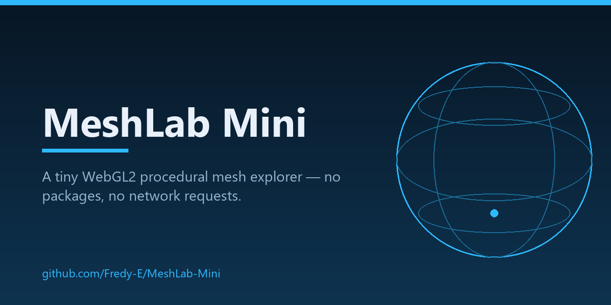
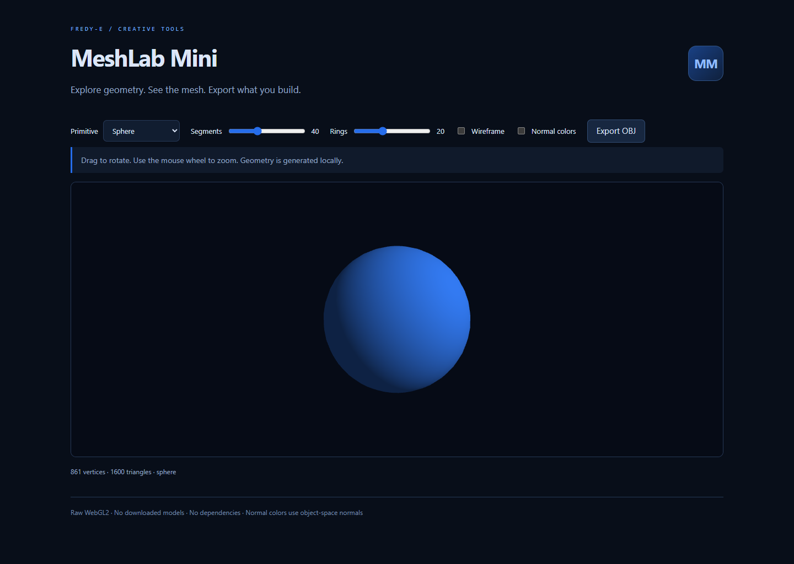

<p align="center">
  
</p>

<p align="center">
  <a href="https://github.com/Fredy-E/MeshLab-Mini/actions/workflows/verify.yml"></a>
  
  
  
  
</p>

## What this is

Open `index.html` in a modern browser. Choose a sphere, torus, or capped cylinder; adjust subdivisions; rotate and zoom; inspect wireframe or object-space normal colors; and export OBJ geometry with normals.

The renderer uses WebGL2 directly. The mesh generator and OBJ exporter still work when WebGL2 is unavailable. There are no runtime packages or network requests.

This is an independent small procedural explorer and is **not affiliated with the MeshLab project**.



## Features

- Procedural sphere, torus, and capped cylinder generated from formulas (segments / rings adjustable).
- Drag to rotate, wheel to zoom; wireframe and object-space normal-color modes.
- Export OBJ with vertices, normals, and `v//vn` faces; no downloaded models, no dependencies.
- One static page with no network requests; mesh generation and export still work when WebGL2 is unavailable.

## Run

Open `index.html` in a modern browser — no install or server needed. `npm ci` is only required for the test suites.

## Tests

Unit checks (no dependencies):

```sh
node tests/geometry.test.cjs
```

The unit checks cover mesh bounds, face winding, normals, and OBJ output.

Browser end-to-end checks (Playwright 1.63.0, dev-only):

```sh
npm ci
npm run test:browser
```

The browser checks open the app via `file://` and through a loopback-only static server, assert that no request leaves the local machine, read real pixels back from the WebGL2 drawing buffer (non-blank model, shape changes, wireframe, normal colors), verify exported OBJ geometry for sphere and torus, and exercise the no-WebGL2 fallback. On dev machines they use the installed Chrome; in CI they use the bundled Playwright Chromium. Override with `PW_CHANNEL=chrome|msedge|bundled`.

CI (badge above) runs both suites on every push. A manual `pages.yml` workflow prepares a static artifact for GitHub Pages; it does not enable or publish Pages by itself.

## Limits

- A small procedural explorer, not a modeling suite: three parametric surfaces, no file import, no UVs, no topology editing.
- “Normal colors” is a shading mode that colors the surface by object-space normal direction — it is not a normal-vector overlay (a real overlay remains future work).
- Sphere poles and seams keep the classic UV-sphere layout (duplicated seam vertices, degenerate pole rows): fine for display and export, not optimized for simulation.
- Viewing requires WebGL2; without it the mesh still generates and exports, but nothing renders.

## Next

More parametric surfaces, topology diagnostics, and an actual normal-vector overlay.

## See also

[DriverLens](https://github.com/Fredy-E/DriverLens) · [ARM64 Compatibility Radar](https://github.com/Fredy-E/ARM64-Compatibility-Radar) · [Diagnostic Scan Diff](https://github.com/Fredy-E/Diagnostic-Scan-Diff) · [Offline Museum Kit](https://github.com/Fredy-E/Offline-Museum-Kit) — small local-first tools built for Windows-on-ARM work.
